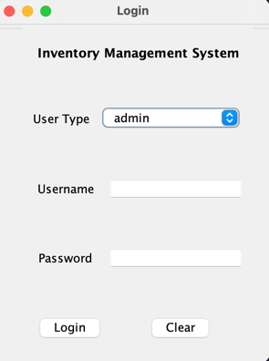
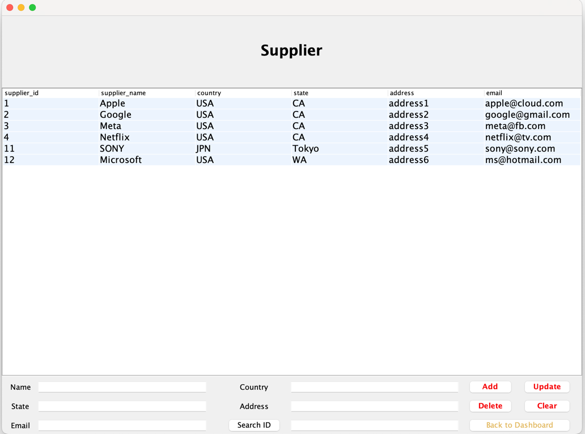
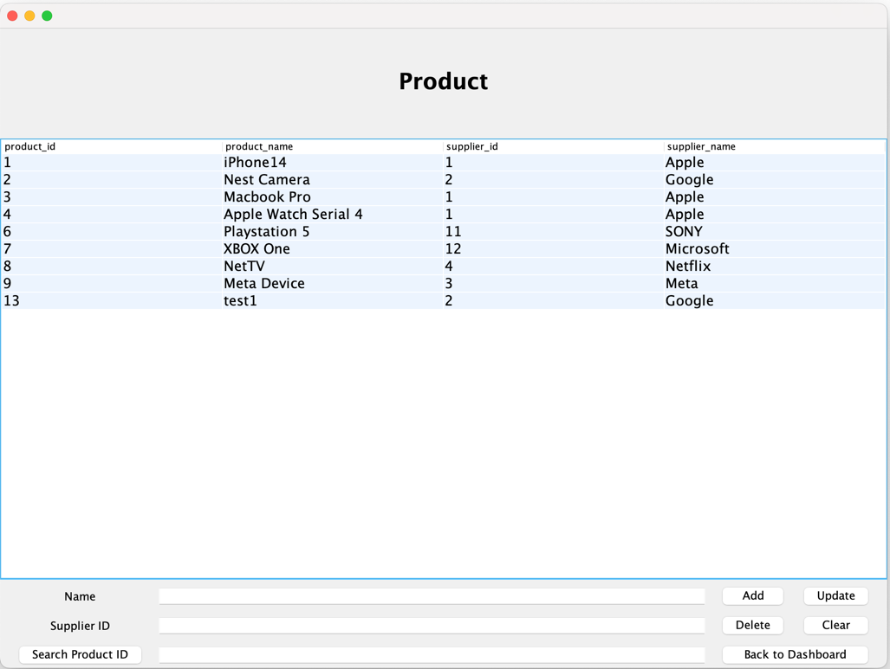
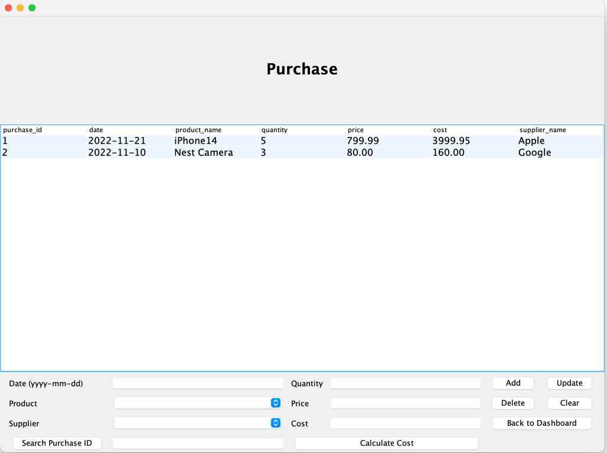
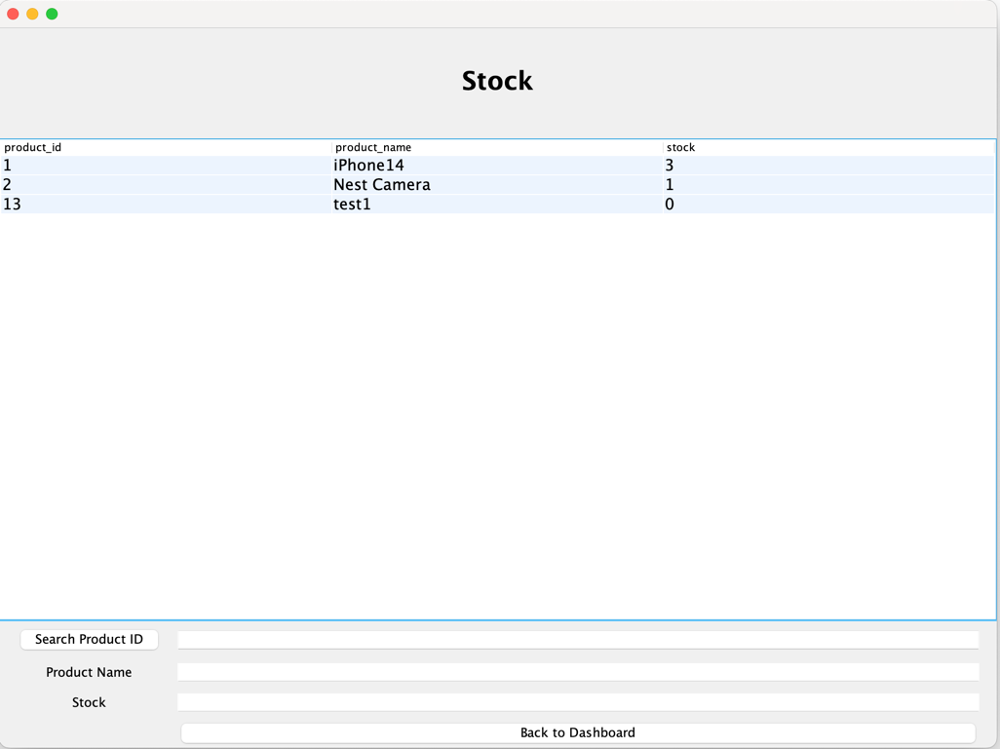
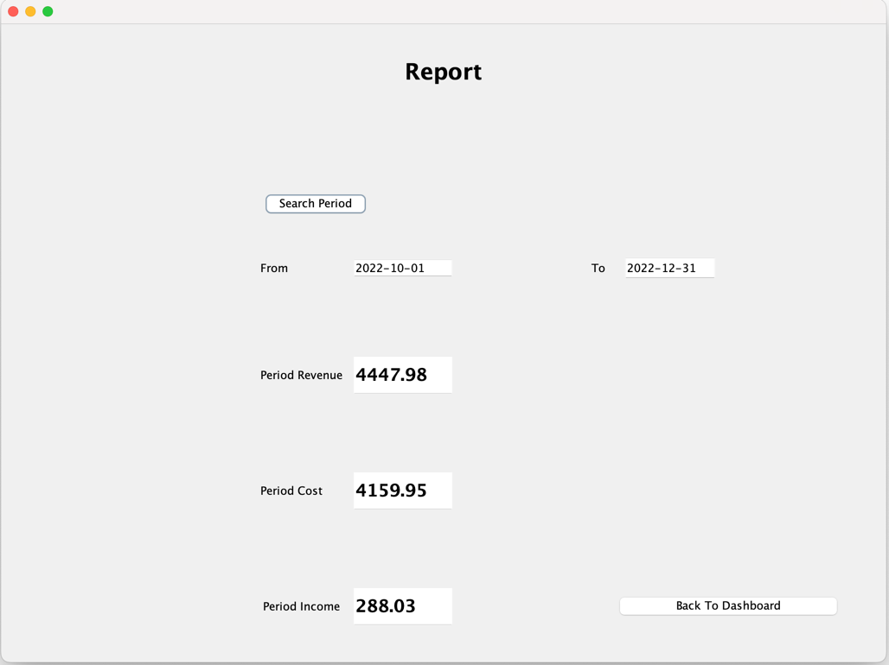

# Inventory Management System

## Overview
This is a simple desktop version of inventory management system. 
The main features are as below:
* Create two types the user account: admin and normal. Admin users have the authority to access certain functions such as report.
* Encrypted password
* Manage user's suppliers and customers
* Manage user's purchase and sales order
* Manage user's products
* Automatic adjust the stock of products according to the purchase and sales activities
* Reporting system for the period of time that user select

## Tech Stacks
* JAVA
* MAVEN
* MySQL

## Screenshots

